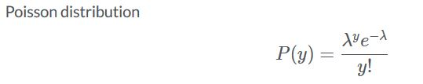

# Generalized-Linear-Models-GLM
Extend regression toolbox with the logistic and Poisson models, by learning how to fit, understand, assess model performance and finally use the model to make predictions on new data.

### Going beyond linear regression
- GLMs provide a versatile framework for statistical modeling of data and are often used to solve pratical probelms.GLMs are generalization of linear models.

<p align="center">
  
</p>

- Suppose we would like to predict salary given years of experience. In regression terms we would write it as salary is predicted by exprience where tilde means "predicted by". (salary ~ experience). `salary = beta0 + beta1 * experience + epsilon`

#### LINEAR MODEL - ols()
- To fit linear models in python we use `statsmodels ols()` function.

```python
# Linear Model
from statsmodels.formula.api import ols

model = ols(formula = 'y ~ X', data=my_data).fit()
```

#### GENERALIZED LINEAR MODEL - glm()

```python
import statsmodels.api as sm
from statsmodels.formula.api import glm

model = glm(formula = 'y ~ X', data=my_data, family=sm.families.____).fit()

# family denotes the probability distribution of the response variable
```

#### Assumptions of linear models
- Using the ols function we obtain the linear fit.The regression function tells us how much the response variable y changes, on average, for a unit increase in x. The model assumptions are 
1. linearity in the parameters,
2. the errors are independent and normally distributed
3. and the variance around the regression line is constant for all values of x.
- But what if the response is not continuous but binary or count ? Or the variance of y is not constant -> depends on the mean. Can we still fit a linear model ?

<p align="center">
  
</p>

#### Linear model and binary response

<p align="center">
  
</p>

1. First we fit a linear model using ols function. Taking the weight at 5.2 and reading of the probability value, we see the fit is structually wrong since we get a value greater than 1, which is not possible by our data.
2. To correct for this we fit a GLM, shown in blue, with the binomial family corresponding to Binomial or logistic regression. Visually there is a significant difference in the fitted models.
3. Now for a value of 5.2, we obtain a probability of 0.99, which is inline with binary data, since it is bounded by 0 and 1.

#### From probabilities to classes

<p align="center">
  
</p>

- To obtain the binary class from computed probabilities, we split the probabilities at say 0.5 which for the weight of 5.2 gives the Yes class. Similarly for weight 1.5 we obtain no class.
- The Binomial GLM provides the means to compute estimated probabilities in the range of the response variable for binary data, unlike linear models which give out of range estimations.

### Build a GLM
- Linear models are not suitable to accommodate different than continuos response data and provide rather strange results. We can overcome such problems with GLMs, which `provide a unified framework for modeling data originating from the exponential family of densities which include Gaussian, Binomial and Poissan among others.`

#### Components of the GLM
- There are 3 components of GLM,


1. the `random component` which defines the response variable y and its probability distribution. One assumption here is that the observations y_1 to y_n are independent.
2. the second component is the `systematic component` which defines which explanatory variables to include in the model. We can include p different explanatory variables. It allows for interaction effects, where one variable depends on another and vice versa or curvilinear effects.
3. the 3rd component is the link function, which connects the random and systematic component.It is the function of the expected value of the response variable which enables linearity in the parameters. By its construction it allows the mean of the response variable to be nonlinearly related to the explanatory variables. **It is the link function which generalized the linear model.**

- The choice of the link function is separate from the choice of random component. Let's review the most common data types and how they are represented in the GLM framework.

#### Continuos -> Linear Regression


- One data type we are familiar with is continuous and approximately normally distributed with the real line as the domain.
- Examples : House prices, salary, person's height etc.
- When fitting a GLM we would use Gaussian for the distribution family where the link function is the identity. The identity link function is of the simplest form where it equals mu or the mean of the response. 
- As such it specifies the linear regression model where y is assumed continuous and for which we can assume a normal distribution for the response. Therefore, the linear regression is the special case of the GLM.

#### Binary -> Logistic Regression


- another data type we encounter quite often is binary data, i.e data with two possible classes, which we usually denote with 0/1 where 1 is true and 0 is false.
- To fit a GLM we should use Binomial distribution where the default link function is the logit. Models of this form are called logistic regression.

#### Count -> Poisson Regression


- Count data are positive and some examples include the number of hurricanes, number of bike crossing on a bridge. etc.
- To fit a GLM we should use Poisson for the distribution where the default link function is logarithm. Models of this form is called Poisson regression.

#### Link functions and their usage


#### Benefits of GLM
- A unified framework for many different data distributions, **Exponential family of distributions**
- **Link function** : The link function transforms the expected value of y and not y itself, and it enables linear combinations, which further provide benefits that many techniques from linear models apply to GLMs as well.

### How to fit a GLM in Python

#### statsmodels
- The starting point is the statsmodels library, which is used for statistical and econometric analysis.

```python
import statsmodels.api as sm
import statsmodels.formula.api as smf
from statsmodels.formula.api import glm  # import glm() directly
```

#### Process of model fit
1. To fit a model we first need to describe the model using the model class glm. -> `glm()`
2. Then the method fit is used to fit the model. -> `.fit()`
3. Very detailed results of the model fit can be analyzed via the summary method. -> `.summary()`
4. Finally, we can compute predictions using the predict method. -> `.predict()`

#### Describing the model
- There are two ways to describe the model, **using formulas or arrays**.

##### Formula based

```python
from statsmodels.formula.api import glm

model = glm(formula, data, family)
```

- The statsmodels uses the pasty package to convert formulas and data to matrices which are then used in model fitting.
- The main arguments are formula, data and family.

##### Array based

```python
import statsmodels.api as sm

X = sm.add_constant(X)
model = sm.glm(y, X, family)
```

- Note that in array-based method the intercept is not included by default. We can add it using the `add_constant` function.

#### Formula Argument


- The formula is at the heart of the modeling function, where the response or output is modeled as a function of the explanatory variables or the inputs.


- **Each explanatory variable is specified and separated with a plus sign.** Note that the formula needs to be enclosed in quotation marks. There are different ways we can represent explanatory variables in the model.
- Categorical variables are enclosed with **Capital C**, removing the intercept is done with minus one, the interaction terms are written in two ways depending on the need, where the semicolon applies to only the interaction term, whereas the multiplication symbol will also, in addition to the interaction term, add individual variables.
- Lastly, we can also add transformations of the variables directly in the formula.

#### Family Argument

`family = sm.families._ _ _ _()`


- Family distributions are in the families namespace. The default link function is denoted in parenthesis, but we can choose other link functions available for each distribution.
- However, if we choose to use a non-default link function, we would have to specify it directly.

#### Summarizing the model

- `model_GLM.summary()`

- To view the results of the model fit we use the summary method, which provides the main information on model fit, such as the model description, model statistics, such as log-likelihood and deviance, and estimated model parameters with their corresponding statistics.
- The estimated parameters are given by coef with their standard error, z scores, p-values and 95% confidence intervals.

#### Regression coefficients
- `.params` prints regression coefficients -> `model_GLM.params`
- To only view the regression coefficients we can use params given model fit.
- Similarly, the confidence intervals for the parameter estimates can be obtained by calling `conf_int` -> `model_GLM.conf_int()`
- `.conf_int(alpha=0.05, cols=None)`
- The default is 95% which we can change using the alpha argument.With cols argument, we can specify which confidence intervals to return.

#### Predictions
- While doing predictive analytics, the final goal is to compute and assess predictions given the fitted model and test data.
- The first step is to specify the test data which should contain all the variables we have included in the final model.
- `.predict(test_data)` computes predictions
- `model_GLM.predict(test_data)`

### Binary data and logistic regression
- Modeling binary data using logistic regression.

#### Binary response data
- Binary data is one of the most common response data types.As the name suggests it is a two-class category, which we usually denote as 0 or 1. For e.g the loan can either default or not.
- We often use logistic regression to model the probability of default for loans. Binary data can occur in two-forms, ungrouped and grouped. Ungrouped data is represented by a single event, like the flip of a coin, with two outcomes having a Bernoulli distribution with probabilty p. This is a special case of Binomial with n equal to 1. `Bernoulli (p) or Binomial(n=1, p)`
- Grouped data, represents multiple events occurring at the same time and measuring the number of successes in an n number of trials. Group data follows a binomial distribution. e.g Flip multiple coins. `Binomial(n, p)`

#### Logistic function


- Consider the following binary data used to predict the probability of passing a test given hours of studying, where PASS = 1 & FAIL = 0
- Mathematically, we would like to predict the probability that the outcome y is in class 1. Here the linear fit is not adequate.
- The S shaped logistic function or the sigmoid curve comes to the rescue, fitting the data and providing the probability of the outcome given x.

#### Odds and odds ratio


- Odds is the ratio of an event occurung to an event not occuring and the odds ratio is just a ratio of two odds.For e.g, given 4 games, the odds of winning a game are 3 to 1, meaning that the event win occured 3 times and loss once.

#### odds and probabilities


- Odds are not probabilities but are directly related and can be computed from each other.e.g odds are the ratio of the probability of the event to the probability of non-event. 
- Writing probability in terms of odds helps us transform our initial unbounded probability model by removing the uper bound whereas the logarithm of odds removes the lower bound.

#### From probability model to logistic regression
- Steps for logistic regression


1. Step 1 : Probability model
2. Step 2 : Logistic function : Applying the logstic function to the model provides the necessary bounds required for our binary data.
3. Step 3: Apply logistic function -> INVERSE-LOGIT : We compute mu, the estimated probability but also the probability of event not occurring, i.e 1-mu


- Finally, computing the odds in terms of probability with log transformation is central to logistic regression.

#### Logistic Regression in Python

```python
model_GLM = glm(formula='y ~x', data = my_data, family = sm.families.Binomial()).fit()
```

- For binary data, the Binomial distribution with the default logit link function is used. Inputs can be binary 0 or 1, or two-level factor such as Yes, No.

### Interpreting coefficients
- The value of the estimated coefficients for each model variable, including the intercept, is provided in the coef column.What do these values represent ?

#### Coefficient beta


- Coefficient beta determines the rate of increase or decrease of the signmoid curve.

#### Linear Vs Logistic
- Generally, it is challenging to interpret coefficients of logistic regression due to nonlinearity. It turns out that the interpretation of the coefficients for the logistic regression is the same as for linear models except that in logistic regression coefficients are in terms of the log odds.

### Interpreting model inference
- The model fit is the best fit given the data we still need information about the significance and size of the effects of the coefficients.

#### Estimation of beta coefficient
- The regression coefficients are obtained by the maximum likelihood estimation, where the value of the parameters maximizes the probability of the observed data. Likelihood is the probability of data given coefficient estimates and that maximizing likelihood or loglikelihood is mathematically equivalent.
- The estimated beta coefficient is where the likelihood takes on its maximum value. Unlike least squares estimation in linear regression, the maximization of the likelihood with respect to beta usually requires an iterative solution, which is sometimes called IRLS or iteratively reweighted least squares.
- To test for the significance of the variables we use the information provided in the model summary, namely standard error, zvalue, its pvalue, and confidence intervals.

#### Standard Error (SE)
- Standard error is the standard deviation of a statistic, i.e coefficient, and its value depends on the shape of the likelihood.
- To compute standard error we take the square root of the variance for the variable. The value of the variance is obtained from the diagonal entries of the model variance-covariance matrix, which is obtained using the cov_params function.

```python
# Extract variance-covariance matrix
print(model_GLM.cov_params())

# compute standard error for weight
std_error = np.sqrt(0.141903)
```

#### Significance testing
- With significance testing we are concerned whether constraining the parameter values to zero would reduce the model fit. We use z-statistics as the ratio of the estimated coefficients and its standard error, which follows the standard normal distribution.
- For zvalue greater than 2 we say that the variable is statistically significant.

#### Confidence intervals of beta
- To report the results in a compelling way we should always report confidence intervals as they provide information on the uncertainity of the estimates. Beta is the estimate and SE is its standard error.


#### Extract confidence intervals
- Using conf_int function we can extract the confidence intervals from the fitted model, where 0 denotes lower bound and one gives upper bound for each variable.

```python
print(model_GLM.conf_int())
```

#### Confidence intervals for odds
- Extract confidence intervals for beta and exponentitate endpoints

```python
print(np.exp(model_GLM.conf_int()))
```

### Computing class predictions

`model_GLM.predict(exog=new_data)`

- From probabilities to classes : having computed predicted probabilities we can classify them using some specified cutoff value.
- First we extract estimated probabilities using fittedvalues function and convert into an array using values.
- Next define probability cut off value at 0.4. Next the prediction class is computed based on the cutoff, i.e for all estimated values greater then 0.4 will be classified as 1 and 0 otherwise.
- Finally,we count the number of observations in each class and report in the table.

```python
# extract fitted probabilities from model
crab['fitted'] = model.fittedvalues.values

# define cut-off value
cut_off = 0.4

# compute class predictions
crab['pred_class'] = np.where(crab['fitted'] > cut_off, 1 ,0)
```

```python
print(pd.crosstab(y_actual, y_predicted, rownames=['Actual'], colnames=['Predicted'],
margins=True))
```

### Count data and Poisson distribution

#### Count data
- Count the number of occurences in a specified unit of time, distance, area or volume.

1. Goals in a soccer match
2. Number of earthquakes
3. Number of crab satellites
4. Number of awards won by a person
5. Number of bike crossings over the bridge

#### Poisson random variable
- Events occur independently and randomly
- Poisson distribution



- `lambda` : mean and variance
- The events are always postive, discete and not continuos. Lower bound is zero but no upper bound.

#### Understanding the parameter of the Poisson distribution.
- Counts can have many zero observations and be right-skewed, which add to the reasons why we wouldn't use the linear model to model count data.


- Poisson distribution changes as we vary the parameter lambda. Notice that, when the lambda=1, the distribution is highly skewed, but as we increase lambda the distribution spreads and becomes more symmetric.

#### Explanatory variables


- The explanatory variable x can be a combination of continuos and categorical variables.
- If all the explanatory variables are categorical then in the literature the model is referred to as the log-linear model.

### Multivariable logistic regression

```python
model = glm('y ~ x1 + x2 + x3 + x4', data = my_data, family = sm.families.Binomial()).fit()
```

#### Multicollinearity
- Occurs when the variables are correlated with each other. Visually we can see that the higher the correlation the more structure is present.
- Including highly correlated variables leads to inflation of standard errors which can result in coefficient not being statistically significant.

#### Presence of multicollinearity 
- We can check for multicollinearity by analyzing the coefficient p-value and its standard errors, whether adding or removing the variable significantly changes the coefficients, the logic of coefficient sign and whether there is a significant correlation between the model variables.

#### Variance inflation factor (VIF)
- The most widely used diagnostic for multicollinearity is the **variance inflation factor of each explanatory variable**.
- It describes how inflated the variance of the coefficient is compared to what it would be if the variables were not correlated with any other variable in the model.
- Suggested threshold VIF is 2.5

```python
from statsmodels.stats.outliers_influence import variance_inflation_factor
```

### Comparing models
- After fitting the model, we need to check whether the inclusion of the variables improves the model fit.

#### Deviance
- To check this we consider a **goodness-of-fit measure called deviance statistic**, which tests the null hypothesis that the fitted model is correct.
- With the goodness of fit we are measuring whether our model is correctly specified and if we add more complexity would it be better. Complexity in this sense means adding more variables, non-linear or interaction terms.
- Deviance is measured in terms of log-likelihood, where formally it is defined as **negative two times the log likelihood of the model fit**. `D = -2LL(beta)`
- It represents the measure of an error where **lower deviance means better model fit**.
- Benchmark for comparison is the **null deviance**, i.e the deviance from the model with only the intercept term.
- **The idea is that as we add additional variables to the model, the deviance would decrease therefore providing for a better fit**.
- Generally, it is assumed that if we were to add a variable with random noise the deviance would decrease by one, so if we add `p predictors` to the model the deviance should `decrease by more than p`.

#### Deviance in Python
- Can be checked in `model.summary()`
- In the top right column of the model summary, we are given the log-likelihood and the deviance statistic.

#### Compute deviance
- Extract null-deviance and deviance

```python
# extract null deviance
print(model.null_deviance)

# extract model deviance
print(model.deviance)
```
- Compute deviance using log likelihood -> `-2 * model.llf`

#### Model complexity
- It is important to note that increasing the number of variables in the model and reducing the deviance may not provide a clear cut path towards a better model fit.
- Say we have two models with likelihoods L1 and L2 where the likelihood of model 2 is lower. We might say that L2 provides the "better fit", however, we also need to take into consideration the model complexity or the number of parameters to be estimated in model with L2 likelihood compared to model 1.
- It can happen that when applying both models to new data model one will produce a better fit than model 2, providing that model 2 is overfitting the training dataset and actually has worse fit on new data. In such situation we say that model 2 does not generalize well on unseen data.
- If this occurs we would need to reduce model complexity to reduce overfitting and improve generalization.


```python
# extract null-deviance and deviance
print(model.null_deviance)

# extract model deviance
print(model.deviance)
```


